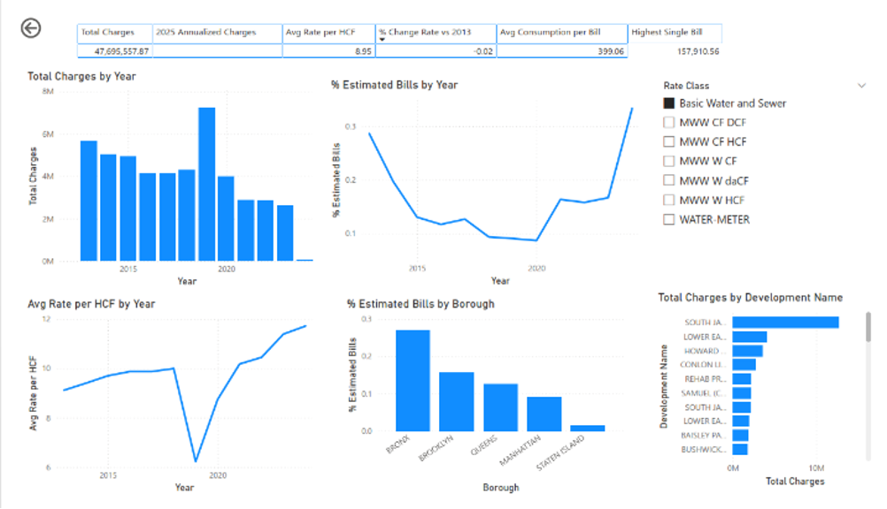
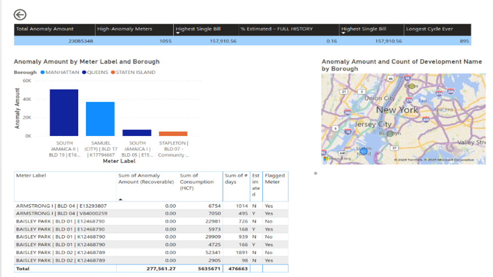

# NYC Water Consumption & Billing Analysis (2013–2025)
Course: Big Data Analytics | University of Delaware  
Team: Rahul Chauhan, Kiran  
Tools: Power BI, Power Query, SQL, Excel  
Data Source: [NYC Open Data – Water Consumption & Cost](https://data.cityofnewyork.us/)

---

## Project Overview
Analyzed 12+ years (2013–2025) of NYC water billing data to investigate the root causes of rising and inconsistent water bills. Acted as NYC data analysts to support audits, investigations, and policy updates.



---

## Business Problem
NYC residents and public facilities have reported significant inconsistencies in water billing. The goal was to determine:
- Does water consumption alone explain the charges?
- Do estimated meter reads contribute to billing variance?
- Do anomalies represent recoverable overcharges?
- How do borough and rate class impact costs?

---

## Dataset
| Attribute | Value |
| Source | NYC Open Data |
| Original Records | 66,433 rows |
| After Cleaning | 14,589 rows |
| Date Range | 2013 – May 2025 |

Key features: Consumption (HCF), Current Charges, Borough, Rate Class, Billing Days, Meter Status (Estimated/Actual)

### Data Cleaning Steps
- Removed 48,925 blank/corrupted rows
- Removed 2,917 zero-value rows (zero consumption, sewer-only entries)
- Stripped $ symbols and commas from monetary fields
- Removed invalid/negative dates


## Analysis Performed
| Type | Description |
| Descriptive: Average billing days, rate per HCF by borough |
| Diagnostic: % Estimated reads, anomaly detection |
| Predictive: Regression model to predict expected charges |
| Prescriptive: Recommendations for billing policy reform |

### Regression Results
- R² = 0.376 — Consumption alone explains only ~38% of billing variance
- Estimated Read Coefficient: 588.83** (p < 0.001) — strong link between estimated reads and inflated charges


## Key Findings
1. Consumption is NOT the main driver** of water bills — structural inconsistencies exist
2. Estimated meter reads** are strongly linked to billing anomalies and overcharges
3. Significant anomaly recovery opportunity** — positive anomaly amounts indicate likely overbilling
4. Brooklyn shows the highest Cost/HCF among boroughs


## Recommendations
1. Invest in Smart/AMR Meters — reduce estimated reads and improve data quality
2. Build a Monthly Anomaly Review Dashboard — monitor and recover misbilled revenue
3. Standardize Borough Billing Policies — address cost/HCF disparities

---

## Repository Structure
```
├── data/               # Cleaned dataset (CSV)
├── powerbi/            # Power BI .pbix dashboard file
├── dashboard_screenshots/  # PNG exports of key visualizations
├── report/             # Final report (PDF)
├── presentation/       # Slide deck (PDF)
└── README.md
```

Key visuals include:
- Billing charges vs. consumption scatter plot by borough
- % Estimated reads trend over time
- Anomaly amount by borough and rate class
- Regression model: expected vs. actual charges
